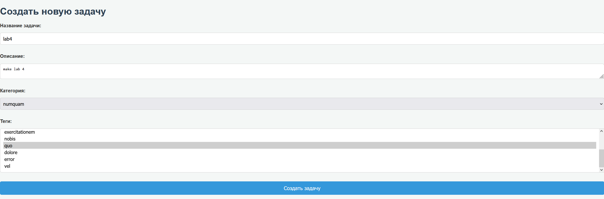
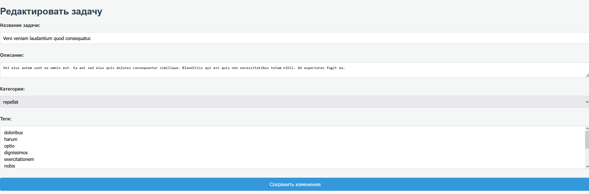

# LAB 4

## Введение

В данном проекте создано простое веб-приложение для управления задачами с использованием фреймворка Laravel и базы данных SQLite. Приложение включает функциональность создания, редактирования, отображения и удаления задач с серверной валидацией данных и защитой от CSRF-атак.


## Миграции и Модели

1. **Модель и Миграция для `Category`:**
   ```bash
   php artisan make:model Category -m
   ```
   - **Структура таблицы:**
     ```php
     Schema::create('categories', function (Blueprint $table) {
         $table->id();
         $table->string('name');
         $table->timestamps();
     });
     ```
   - **Отношение в модели:**
     ```php
     public function tasks()
     {
         return $this->hasMany(Task::class);
     }
     ```

2. **Модель и Миграция для `Task`:**
   ```bash
   php artisan make:model Task -m
   ```
   - **Структура таблицы:**
     ```php
     Schema::create('tasks', function (Blueprint $table) {
         $table->id();
         $table->string('title');
         $table->text('description')->nullable();
         $table->date('due_date');
         $table->foreignId('category_id')->constrained()->onDelete('cascade');
         $table->timestamps();
     });
     ```
   - **Отношение в модели:**
     ```php
     public function category()
     {
         return $this->belongsTo(Category::class);
     }
     ```

3. **Выполнение Миграций:**
   ```bash
   php artisan migrate
   ```

4. **Сидирование Категорий:**
   ```bash
   php artisan make:seeder CategorySeeder
   ```
   - **Содержимое `CategorySeeder.php`:**
     ```php
     public function run()
      {
          // Создание 10 категорий
          Category::factory(10)->create();
      }
     ```
   - **Регистрация сидера и выполнение:**
     ```php
     // В DatabaseSeeder.php
     $this->call(CategorySeeder::class);
     ```
     ```bash
     php artisan db:seed
     ```

## Контроллеры и Маршруты

1. **Создание Ресурсного Контроллера:**
   ```bash
   php artisan make:controller TaskController --resource
   ```

2. **Маршруты:**
   ```php
   // В routes/web.php
   use App\Http\Controllers\TaskController;
   Route::resource('tasks', TaskController::class);
   ```

## Валидация Данных

1. **Классы Запросов:**
   - **Создание `CreateTaskRequest`:**
     ```bash
     php artisan make:request CreateTaskRequest
     ```
     - **Правила валидации:**
       ```php
       public function rules()
        {
            return [
                'title' => 'required|string|max:255',
                'description' => 'nullable|string',
                'category_id' => 'required|exists:categories,id',
                'tags' => 'nullable|array',
                'tags.*' => 'exists:tags,id',
            ];
        }
       ```
   
   - **Создание `UpdateTaskRequest`:**
     ```bash
     php artisan make:request UpdateTaskRequest
     ```
     - **Правила валидации аналогичны `CreateTaskRequest`.**

2. **Использование в Контроллере:**
   ```php
    public function store(CreateTaskRequest  $request)
      {
          // Валидация данных из формы
          $validated = $request->validate([
              'title' => 'required|string|max:255',
              'description' => 'nullable|string',
              'category_id' => 'required|exists:categories,id',
              'tags' => 'nullable|array',
              'tags.*' => 'exists:tags,id',
          ]);
        
        // Создаем новую задачу
        $task = Task::create([
            'title' => $validated['title'],
            'description' => $validated['description'],
            'category_id' => $validated['category_id'],
        ]);

        // Привязываем теги, если они были выбраны
        if (isset($validated['tags'])) {
            $task->tags()->attach($validated['tags']);
        }

        // Добавление флеш-сообщения
        session()->flash('success', 'Задача успешно создана!');

        return redirect()->route('tasks.index');
    }

       public function update(Request $request, $id)
    {
        // Валидация данных
        $validated = $request->validate([
            'title' => 'required|string|max:255',
            'description' => 'nullable|string',
            'category_id' => 'required|exists:categories,id',
            'tags' => 'nullable|array',
            'tags.*' => 'exists:tags,id',
        ]);

        $task = Task::findOrFail($id);
        $task->update([
            'title' => $validated['title'],
            'description' => $validated['description'],
            'category_id' => $validated['category_id'],
        ]);

        // Обновляем теги
        $task->tags()->sync($validated['tags'] ?? []);

        return redirect()->route('tasks.show', $task->id);
    }
   ```

## Формы и Шаблоны

1. **Основной Макет (`layouts.app.blade.php`):**
   - Подключение Bootstrap.
   - Включение навигационной панели.
   - Отображение флеш-сообщений.
   - Размещение основного контента через `@yield('content')`.

2. **Форма Создания Задачи (`tasks.create.blade.php`):**
   - Поля: Название, Описание, Дата выполнения, Категория.
   - Директива `@csrf` для защиты от CSRF.
   - Отображение ошибок валидации рядом с полями.

3. **Форма Редактирования Задачи (`tasks.edit.blade.php`):**
   - Аналогична форме создания с предзаполненными данными.
   - Использование метода `PUT` через `@method('PUT')`.

4. **Список Задач (`tasks.index.blade.php`):**
   - Таблица с задачами.
   - Кнопки "Редактировать" и "Удалить" для каждой задачи.
   - Отображение флеш-сообщений.

## Защита от CSRF

- Все формы включают директиву `@csrf`, обеспечивая защиту от CSRF-атак.
- Формы используют только метод `POST` для отправки данных, соответствуя маршрутам Laravel.

## Флеш-Сообщения

- Добавлены флеш-сообщения для подтверждения успешных операций (создание, обновление, удаление задач).
- Сообщения отображаются в основном макете `layouts.app.blade.php` и используют стили Bootstrap для уведомлений.

## Функциональность Обновления Задачи

1. **Маршруты:**
   - `GET /tasks/{task}/edit` — форма редактирования.
   - `PUT /tasks/{task}` — обновление задачи.

2. **Контроллер:**
   - Методы `edit` и `update` обрабатывают отображение формы и сохранение изменений соответственно.

3. **Шаблоны:**
   - Форма редактирования предоставляет пользователю возможность изменить данные задачи с предзаполненными текущими значениями.

## Тестирование

1. **Создание Задачи:**
   - Заполнение формы с корректными данными.
   
2. **Редактирование Задачи:**
   - Изменение данных существующей задачи.
   
3. **Защита от CSRF:**
   - Убедиться, что формы защищены и запросы без CSRF-токена отклоняются.
## Заключение

Проект успешно реализует базовую функциональность управления задачами с использованием Laravel и SQLite. Внедрены механизмы защиты и валидации данных, обеспечивающие безопасность и удобство использования приложения. Дальнейшее развитие проекта может включать добавление аутентификации пользователей, расширение функциональности и улучшение интерфейса.

## Контрольные вопросы

1. **Что такое валидация данных и зачем она нужна?**  
   Проверка соответствия входных данных определённым правилам для защиты и корректной работы приложения.

2. **Как обеспечить защиту формы от CSRF-атак в Laravel?**  
   Использовать CSRF-токены, автоматически включённые в формы через `@csrf`.

3. **Как создать и использовать собственные классы запросов (Request) в Laravel?**  
   Создать с помощью `php artisan make:request RequestName`, добавить правила в метод `rules()`, использовать класс в контроллере.

4. **Как защитить данные от XSS-атак при выводе в представлении?**  
   Использовать функцию `{{ $variable }}`, которая экранирует HTML.
